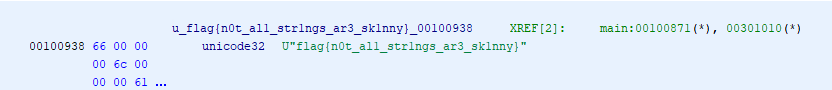

# redpwnCTF-2021

* **Category:**  Rev
* **Points:** 102pts
* **Author:** [Vivian](https://github.com/vivian-dai)

## Challenge
> Some strings are wider than normal...
[`wstrings`](./bin/wstrings)


If we open up [`wstrings`](./bin/wstrings) in [Ghidra](https://ghidra-sre.org/) and look at the main function, it shows this code:
```c

undefined8 main(void)

{
  int iVar1;
  long in_FS_OFFSET;
  wchar_t local_158 [82];
  long local_10;
  
  local_10 = *(long *)(in_FS_OFFSET + 0x28);
  wprintf(L"Welcome to flag checker 1.0.\nGive me a flag> ");
  fgetws(local_158,0x50,stdin);
  iVar1 = wcscmp((wchar_t *)flag,local_158);
  if (iVar1 == 0) {
    fputws(L"Correct!",stdout);
  }
  if (local_10 != *(long *)(in_FS_OFFSET + 0x28)) {
                    /* WARNING: Subroutine does not return */
    __stack_chk_fail();
  }
  return 0;
}
```
On this line `iVar1 = wcscmp((wchar_t *)flag,local_158);` if we click flag, it shows

```
FLAG: flag{n0t_al1_str1ngs_ar3_sk1nny}
```